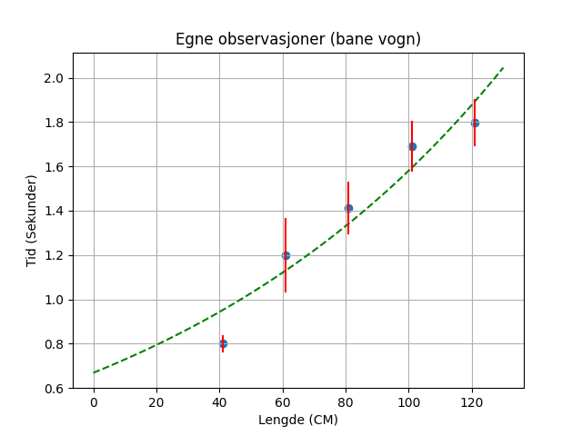
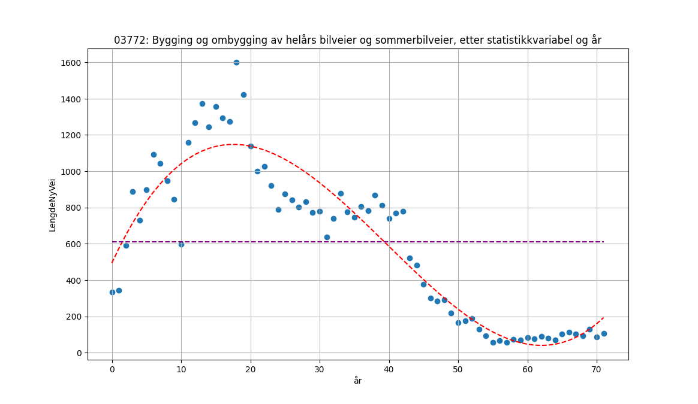

# Selvstendig arbeid med reelle datasett

*For å se alle filer som var med i dette prosjektet kan du se på [GitHub](https://github.com/PederHatlen/ReelleDatasett_MatteR1)*

## Fremgangsmåte

Jeg valgte å gjøre oppgavene i Python.  

Problemstillingen jeg valgte var hvor mye ny skogsvei det har blitt bygget per år i norge.  
Dette valgte jeg fordi SSB på denne statestikken hadde data siden 1950.

### Del 1

Det første jeg gjorde var å gjøre øvingsoppgavene med egne observasjoner (`egneObservasjoner.py`, `data/egneObservasjoner.json`).  
Dataen har utgangspunkt i en bane som er `121 cm` lang og `3 cm` over bakken på den ene siden. Målingene var av hvor lang tid en vogn brukte på å kjøre ned banen.  
Programmet fungerer ved å først hente inn data fra en json fil og dermed kjøre gjennom vert punk og regne ut gjennomsnitt, standardavvik, standardfeil og feilmargin. Programmet tegner dermed alle verdiene til en graf (se graf 1).  
Jeg fikk dermed disse konstantleddene i regresjonsfunksjonen.  
`a=0.6687110429861656`  
`b=1.008639338569404`

#### Kode (del 1)

Kalkulere data:

```python
tmpArr = np.array(data[i]).astype(float)
arrLen = len(tmpArr)
arrSum = sum(tmpArr)
# Kalkulering av verdier
avgVal = arrSum / arrLen
STDavvik = np.sqrt(sum((tmpArr - avgVal)**2) / (len(tmpArr) - 1))
STDFeil = STDavvik / np.sqrt(arrLen)
fMarg = 2*STDFeil
```

Regresjonsanaluse og plotte grafer/punkter:

```python
# Kalkulerings funksjon
def objective(x, a, b): 
    return a*b**x
# finne objective sine tilnermede konstantledd
fit = curve_fit(objective, x, y, [41, 0.8])
# Konstantledd
a = fit[0][0]
b = fit[0][1]
# Verdier
x_values = np.linspace(0, 130)
y_values = objective(x_values, a, b)
# Tegne Punkt, Variasjon og Regresejonsgraf
plt.plot(x_values, y_values, "--", color="Green")
plt.vlines(x, y - 2*fmargArr, y + 2*fmargArr, "r")
plt.scatter(x, y)
```

### Del 2

Mitt andre programm henter først ut data fra ssb sin web-api ([ssb.no/api](https://www.ssb.no/api)).  
Denne dataen blir dermed cachet, sån at man slipper å hente samme data ut flere ganger (Variabelen newData bestemmer henting av ny data).  
Etter dette henter programmet ut alle verdiene markert med tid som x og plaseringen som y verdiene.  
Programmet gjør dermed en regresjonsanalyse, og får ut fire konstantledd (`a`, `b`, `c`, `d`) som sammen danner funksjonen `f(x) = a*x**3 + b*x**2 + c*x + d`.  
I skogsvei datasettet blir `a = 0.025173298020146784`, `b = -3.005141260417284`, `c = 82.23125326274656` og `d = 494.5656629232`.

#### Kode (del 2)

Hente data fra api:

```python
post_url = "https://data.ssb.no/api/v0/no/table/03772/" # Skogsvei
query = loads(open("query/skogsvei.json", "r").read())
rawdata = post(post_url, json = query)
data = rawdata.text
open("data/cache.json", "w", encoding="utf_8").write(data)
```

Generere/plotte regresjonsanalyse:

```python
# Numpy regresjonsanalyse (polynom) med pDegree som polynomgrad
model = np.poly1d(np.polyfit(xArr, yArr, pDegree))
# Printe alle konstantledd (skaleres rundt polynomgrad)
for i in range(len(model.coefficients)):
    print(alphabet[i],"=", model.coefficients[i])
plt.plot(xArr, model(xArr), "--", color="red")
```

## Resultater

### Grafer

#### Graf 1 (Egne observasjoner / del 1)

  

#### Graf 2 (Ny/oppgradert skogsvei over tid / del 2)

`år 0 = 1950`

  

### Output fra programmene

#### Egne observasjoner (del 1)

```txt
121 cm fra start: [1.82, 1.77, 1.72, 1.88, 1.8]
Gjennomsnittet er: 1.798
Standardavvik er: 0.05933
Standardfeil er: 0.02653
Feilmargin er: 0.05307

101 cm fra start: [1.72, 1.65, 1.6, 1.72, 1.76]
Gjennomsnittet er: 1.69
Standardavvik er: 0.06403
Standardfeil er: 0.02864
Feilmargin er: 0.05727

81 cm fra start: [1.49, 1.31, 1.44, 1.42, 1.4]
Gjennomsnittet er: 1.412
Standardavvik er: 0.06611
Standardfeil er: 0.02956
Feilmargin er: 0.05913

61 cm fra start: [1.18, 1.36, 1.17, 1.11, 1.18]
Gjennomsnittet er: 1.2
Standardavvik er: 0.09407
Standardfeil er: 0.04207
Feilmargin er: 0.08414

41 cm fra start: [0.83, 0.8, 0.78, 0.78, 0.81]
Gjennomsnittet er: 0.8
Standardavvik er: 0.02121
Standardfeil er: 0.00949
Feilmargin er: 0.01897

a=0.6687110429861656
b=1.008639338569404
```

#### SSB data (del 2)

```txt
a = 0.025173298020146784
b = -3.005141260417284
c = 82.23125326274656
d = 494.5656629232
```

## Mine funn

I dette prosjektet har jeg funnet ut at Norge bygde en del skogsveier rundt `1950 - 1990`, men at det har sunket ganske kraftig siden da.  
Jeg har også lært meg to forskjellige regresjonsmetoder i python og lært meg litt av logikken bak programatisk regresjon under reaserchen av disse metodene.
